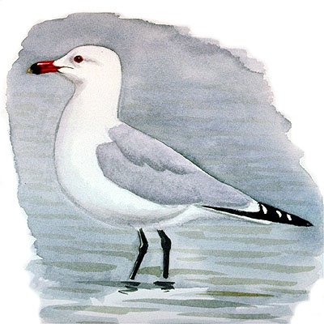
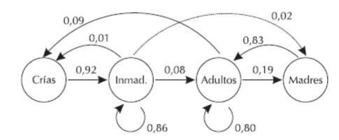
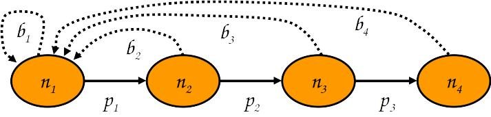

# R como herramienta de análisis y modelado

R ([https://cran.r-project.org/](https://cran.r-project.org/)) es un entorno
de programación estadística y graficado, libre y gratuito.


En vez de dialogos como en excel, vamos a tener que programar un *script*
para que haga los modelos y cálculos que necesitamos.

Una buena (y gratutita) introducción a R para el análisis de datos la podeís
encontrar en:

R for Data Science (https://r4ds.had.co.nz/)


---

# Ejercicio 1

A partir del fichero 'CensoDelta.xls' (colgado en el cv), que contiene el número
de parejas de gaviota de Audouin (*Larus audouinii*) censadas en el Delta del Ebro
entre los años 1981 y 2010:

  a. Representar gráficamente el número de parejas en función del tiempo y
     ajustar la ecuación del modelo exponencial. 
  
  b. Calcular la tasa intrínseca de crecimiento poblacional (r) media para todo
     el período y su desviación estándar.
     
```{r gaviota, echo = FALSE}

```


---

# Ejercicio 1

Recordar:

Supongamos que no hay movimientos migratorios (población cerrada):

$$ N_{t+1} = N_t + B + D \Rightarrow \frac{dN}{dt} = B - D $$

Supongamos que las tasas de natalidad y mortalidad son una función lineal del
tamaño poblacional:

$$ B = \mathit{b}·N $$
$$ D = \mathit{d}·D $$
$$ \frac{dN}{dt} = (b - d)·N = \mathbf{r}·N $$
**r**: tasa instantánea (intrínseca) de crecimiento

---

# Ejercicio 1.

Nos queda una ecuación diferencial de primer orden. Si la resolvemos integrando:

$$ \frac{dN}{dt} = r·N \Rightarrow \int\frac{dN}{N} = \int r·dt \Rightarrow ln(N) = r·t + C$$

si definimos que cuando $t = 0 \Rightarrow N = N_0$, tenemos que $C = ln(N_0)$ y:  

$$ N_t = N_0·\rm{e}^{rt}$$

---

# Ejercicio 1.

En muchas especies las generaciones son discretas y el modelo continuo no es
aplicable:

$$ N_{t+1} = \lambda·N_t \Rightarrow N_t = \lambda^t· N_0$$

Cuando el paso de tiempo se hace muy pequeño el modelo discreto converge al
modelo continuo:

$$ \rm{e}^{rt} = \lambda^t \Leftarrow\Rightarrow r = ln(\lambda)$$

---

# Ejercicio 1.

## ¿Cómo hacemos esto en R?

Lo primero son las librerías que necesitaremos:
```{r libraries}
library(readxl)
library(dplyr)
```

---

# Ejercicio 1.

Lo segundo es cargar los datos:
```{r data}
datos_censo <- read_excel("CensoDelta.xls")
names(datos_censo) <- c('Any', 'Parelles')
datos_censo$Any <- as.numeric(datos_censo$Any)

datos_censo
```

---

# Ejercicio 1.

>a. Representar gráficamente el número de parejas en función del tiempo y
    ajustar la ecuación del modelo exponencial:
   
```{r plot}
# ajustar el modelo:
modelo_exponencial <- lm(log(Parelles) ~ Any, data = datos_censo)
# ver los coeficientes
coef(modelo_exponencial)
```

---

# Ejercicio 1.

>a. Representar gráficamente el número de parejas en función del tiempo y
    ajustar la ecuación del modelo exponencial
   
```{r coefs}
coef(modelo_exponencial)
```

Con los coeficientes podemos sacar la ecuación,
**pero recordar**, hemos transformado la variable `Parejas` mediante el logaritmo
neperiano a la hora de hacer el modelo, asi pues, la ecuación de nuestro modelo
exponencial debería ser:

exp(`r round(coef(modelo_exponencial)[1], 3)`) ·
exp(`r round(coef(modelo_exponencial)[2], 3)` · t)

que queda como:

$$1.419·10^{-108} · exp(0.129 · t)$$

---

# Ejercicio 1.

>a. Representar gráficamente el número de parejas en función del tiempo y
    ajustar la ecuación del modelo exponencial
   
Para graficarlo, usamos plot:

```{r plot_censo, eval=FALSE}
plot(datos_censo$Any, datos_censo$Parelles)
lines(
  datos_censo$Any, 1.419e-108 * exp(0.129*datos_censo$Any),
  col = 'red'
)
```


---

```{r plot_censo_real}
plot(datos_censo$Any, datos_censo$Parelles)
lines(
  datos_censo$Any, 1.419e-108 * exp(0.129*datos_censo$Any),
  col = 'red'
)
```

---

# Ejercicio 1.

>b. Calcular la tasa intrínseca de crecimiento poblacional (r) media para todo
    el período y su desviación estándar.
   
Recordad,

$$N_{t+1} = \lambda·N_t \Rightarrow \lambda = \frac{N_{t+1}}{N_t}$$

y:

$$ r = ln(\lambda)$$
Así que:
```{r}
# calculamos lambda y R
datos_censo_tasa_crecim <- datos_censo %>%
  mutate(
    lambda = Parelles/lag(Parelles),
    r = log(lambda)
  )
```

---

# Ejercicio 1.

>b. Calcular la tasa intrínseca de crecimiento poblacional (r) media para todo
    el período y su desviación estándar.

```{r}
datos_censo_tasa_crecim
```

---

# Ejercicio 1.

>b. Calcular la tasa intrínseca de crecimiento poblacional (r) media para todo
    el período y su desviación estándar.

```{r}
# calculamos media y desviación
datos_censo_tasa_crecim %>%
  summarise(
    media = mean(r, na.rm = TRUE),
    desvest = sd(r, na.rm = TRUE)
  )
```
---

# Ejercicio 2.

Realizar proyecciones del tamaño de una población que crece según el diagrama
de transiciones siguiente (los números son las probabilidades de transición
anuales para las **hembras**):

```{r ejercicio_2_diagrama_transiciones, echo = FALSE}

```


Para ello, calcula el número de hembras previsto por los años 2010, 2020, ...
2050 y representa los resultados gráficamente, tanto en cuanto a la evolución de
la población total como para la de los diferentes estadios. Considera que la
población inicial (año 2000) es de 300 hembras adultas.


---

# Ejercicio 2.

```{r diagrama_transiciones_ejemplo, echo = FALSE}

```


$$n_{1,t+1} = n_{1,t}·b_1 + n_{2,t}·b_2 + \ldots + n_{m,t}·b_m = \sum_{i = 1}^m n_{i,t}·b_i$$

$$n_{2, t+1} = n_{1,t}·p_1$$

$$ \ldots $$

---

# Ejercicio 2.

Si $n_{t+1} = \lambda·n_t$, entonces:

$$\left.\begin{array}{l} n_1 = \lambda·n_0 \\ n_2 = \lambda·n_1 = \lambda·\lambda·n_0 = \lambda^2·n_0 \\ n_3 = \lambda·n_2 = \lambda·\lambda^2·n_0 = \lambda^3·n_0 \\ n_4 = \lambda·n_3 = \lambda·\lambda^3·n_0 = \lambda^4·n_0 \\ \end{array}\right\} n_t = \lambda^t·n_0$$ 

Así pues, podemos construir una matriz de poblaciones que multiplicado por las poblaciones iniciales para cada nivel de desarrollo nos de los valores
para el siguiente punto temporal:

$$\begin{bmatrix}n_{1,t+1}\\n_{2,t+1}\\n_{3,t+1}\\n_{4,t+1}\end{bmatrix} = \begin{bmatrix} b_1 & b_2 & b_3 & b_4\\ p_1 & 0 & 0 & 0 \\ 0 & p_2 & 0 & 0 \\ 0 & 0 & p_3 & 0 \end{bmatrix} · \begin{bmatrix}n_{1,t}\\n_{2,t}\\n_{3,t}\\n_{4,t}\end{bmatrix}$$

---

# Ejercicio 2.

## ¿Cómo hacemos esto en R?

Lo primero son las librerías que necesitaremos:
```{r libraries_2}
library(ggplot2)
library(tidyr)
library(dplyr)
```

---

# Ejercicio 2.

Lo siguiente es crear los datos. En este caso no tenemos un excel, así que
tenemos que fabricarnos la matriz de poblaciones nosotros mismos a partir
del esquema proporcionado:

```{r ejercicio_2_diagrama_transiciones_2, echo = FALSE}

```

---

```{r ejercicio_2_diagrama_transiciones_3, echo = FALSE}

```


```{r matriz_pob}
matriz_pob_struc <- matrix(c(
  0, 0.01, 0.09, 0,
  0.92, 0.86, 0, 0,
  0, 0.08, 0.8, 0.83,
  0, 0.02, 0.19, 0
), nrow = 4, byrow = TRUE)

matriz_pob_struc
```

---

# Ejercicio 2.

Lo mismo para la matriz de poblaciones incial (son 300 hembra adultas):

```{r matriz inicial}
matriz_inicial <- matrix(c(
  0,
  0,
  300,
  0
), nrow = 4, byrow = TRUE)

matriz_inicial
```

Y ya tenemos listo los datos de partida

---

# Ejercicio 2.

> Para ello, calcula el número de hembras previsto por los años 2010, 2020, ...
2050 y representa los resultados gráficamente, tanto en cuanto a la evolución de
la población total como para la de los diferentes estadios. Considera que la
población inicial (año 2000) es de 300 hembras adultas.

Nuestro modelo para el año 2001 seria:

$$\begin{bmatrix}Crías_{2001}\\Inmad_{2001}\\Adultos_{2001}\\Madres_{2001}\end{bmatrix} = \begin{bmatrix} 0 & 0.01 & 0.09 & 0\\ 0.92 & 0.86 & 0 & 0 \\ 0 & 0.08 & 0.8 & 0.83 \\ 0 & 0.02 & 0.19 & 0 \end{bmatrix} · \begin{bmatrix}0\\0\\300\\0\end{bmatrix} = \begin{bmatrix}27\\0\\240\\57\end{bmatrix}$$

---

# Ejercicio 2.

> Para ello, calcula el número de hembras previsto por los años 2010, 2020, ...
2050 y representa los resultados gráficamente, tanto en cuanto a la evolución de
la población total como para la de los diferentes estadios. Considera que la
población inicial (año 2000) es de 300 hembras adultas.

Podemos ver que esto es así multiplicando las matrices en R:

```{r matrix_prod}
res_2001 <- matriz_pob_struc %*% matriz_inicial
res_2001
```

---

# Ejercicio 2.

> Para ello, calcula el número de hembras previsto por los años 2010, 2020, ...
2050 y representa los resultados gráficamente, tanto en cuanto a la evolución de
la población total como para la de los diferentes estadios. Considera que la
población inicial (año 2000) es de 300 hembras adultas.

Y por tanto, para 2002:

$$\begin{bmatrix}Crías_{2002}\\Inmad_{2002}\\Adultos_{2002}\\Madres_{2002}\end{bmatrix} = \begin{bmatrix} 0 & 0.01 & 0.09 & 0\\ 0.92 & 0.86 & 0 & 0 \\ 0 & 0.08 & 0.8 & 0.83 \\ 0 & 0.02 & 0.19 & 0 \end{bmatrix} · \begin{bmatrix}27\\0\\240\\57\end{bmatrix} = \begin{bmatrix}22\\25\\239\\46\end{bmatrix}$$
---

# Ejercicio 2.

> Para ello, calcula el número de hembras previsto por los años 2010, 2020, ...
2050 y representa los resultados gráficamente, tanto en cuanto a la evolución de
la población total como para la de los diferentes estadios. Considera que la
población inicial (año 2000) es de 300 hembras adultas.

Podemos ver que esto es así multiplicando las matrices en R:

```{r matrix_prod_2002}
res_2002 <- matriz_pob_struc %*% res_2001
res_2002
```

Pero tenemos que hacerlo hasta 2050, así que en R podemos hacer un pequeño
bucle (loop) para que nos calcule todo.

---

# Ejercicio 2.

> Para ello, calcula el número de hembras previsto por los años 2010, 2020, ...
2050 y representa los resultados gráficamente, tanto en cuanto a la evolución de
la población total como para la de los diferentes estadios. Considera que la
población inicial (año 2000) es de 300 hembras adultas.

```{r for_loop}
matriz_final <- matriz_inicial
for (time_step in 1:50) {
  matriz_final <- cbind(
    matriz_final,
    round(matriz_pob_struc %*% matriz_final[,time_step], 0)
  )
}
matriz_final
```

---

# Ejercicio 2.

> Para ello, calcula el número de hembras previsto por los años 2010, 2020, ...
2050 y representa los resultados gráficamente, tanto en cuanto a la evolución de
la población total como para la de los diferentes estadios. Considera que la
población inicial (año 2000) es de 300 hembras adultas.

Podemos mejorar un poco el output, para verlo mejor

```{r eval = FALSE}
datos_finales <- t(matriz_final) %>%
  as.data.frame()
names(datos_finales) <- c('Crias', 'Inmaduros', 'Adultos', 'Madres')
datos_finales <- datos_finales %>%
  mutate(
    Total = Crias + Inmaduros + Adultos + Madres,
    Año = 2000:2050
  ) %>%
  pivot_longer(cols = Crias:Total, names_to = 'Stage')
datos_finales
```

---

```{r}
datos_finales <- t(matriz_final) %>%
  as.data.frame()
names(datos_finales) <- c('Crias', 'Inmaduros', 'Adultos', 'Madres')
datos_finales <- datos_finales %>%
  mutate(
    Total = Crias + Inmaduros + Adultos + Madres,
    Año = 2000:2050
  ) %>%
  pivot_longer(cols = Crias:Total, names_to = 'Stage')
datos_finales
```

---

# Ejercicio 2.

> Para ello, calcula el número de hembras previsto por los años 2010, 2020, ...
2050 y representa los resultados gráficamente, tanto en cuanto a la evolución de
la población total como para la de los diferentes estadios. Considera que la
población inicial (año 2000) es de 300 hembras adultas.

Ahora podemos graficar:

```{r estruc_plot, eval = FALSE}
datos_finales %>%
  ggplot(
    aes(x = Año, y = value, color = Stage)
  ) +
  geom_point()
```


---

```{r estruc_plot_2}
datos_finales %>%
  ggplot(
    aes(x = Año, y = value, color = Stage)
  ) +
  geom_point()
```

